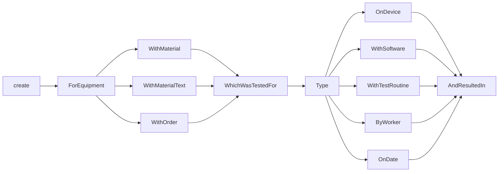
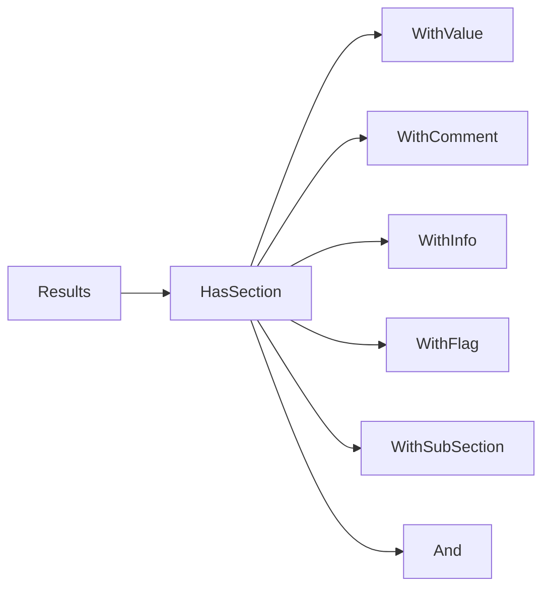

# FluentMeasurements

## Introduction

```mermaid
flowchart LR
    10[create]-->20[ForEquipment]
    20-->30[WithMaterial]
    20-->40[WithMaterialText]
    20-->50[WithOrder]
    30-->60["WhichWasTestedFor"]
    40-->60
    50-->60
    60-->65[Type]
    65-->70[OnDevice]
    65-->80[WithSoftware]
    65-->90[WithTestRoutine]
    65-->100[ByWorker]
    65-->110[OnDate]
    70-->120[AndResultedIn]
    80-->120
    90-->120
    100-->120
    110-->120
    
```

## Values

```mermaid  
flowchart LR
    120[Results]
    120-->130[HasSection]
    130-->140[WithValue]
    130-->150[WithComment]
    130-->160[WithInfo]
    130-->170[WithFlag]
    130-->180[WithSubSection]
    130-->190[And]
```